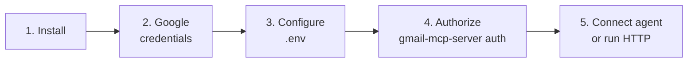

# 📧 Gmail MCP Server

> A [Model Context Protocol](https://modelcontextprotocol.io) server that lets AI
> agents work with a Gmail account **safely** — read, search, summarize, and
> (opt-in) forward/archive/label — behind a layered safety model.

> **🔐 You bring your own Google app.** This is a **local tool, not a hosted
> service** — you create your own OAuth client in your own Google Cloud project
> and authorize your own mailbox. Your credentials and token never leave your
> machine, and because the app only ever authorizes you, **there's no central
> service and no Google verification to wait for.**

> **ℹ️ Status:** pre-release (`0.1.0`), fully functional locally. Not yet on PyPI —
> install from source (below). See the [Roadmap](#-roadmap-to-10).

## ✨ Features

| | |
|---|---|
| 📥 **Email operations** | Search, read, forward, archive, delete, draft, and label |
| 🧠 **Intelligence** | Caller-first prompts (summarize, classify, reply, action items) + optional server-side digests |
| 🔎 **Semantic search** | Natural-language vector search over your mail |
| 🔔 **Notifications** | Webhook / Redis event fan-out |
| 🛡️ **Railguards** | Read-only by default, allowlists, rate limits, archive-first delete, draft-first send, audit log |

## 🚀 Quick start

You need **Python 3.11+** and a Google account. Five minutes end to end.



**1. Install** (from source until published — see [Installation](#-installation)):

```bash
pip install "git+https://github.com/CoolDevGuys/agentic-mail-mcp.git"
```

**2. Get Google credentials** — in *your* Google Cloud project, enable the Gmail
API, make a **Desktop-app OAuth client**, and **download its `credentials.json`**.
Full walkthrough with the exact clicks:
[Getting your Google credentials 👉](specs/docs/configuration.md#getting-your-google-credentials-oauth).

**3. Configure** — copy `.env.example` to `.env` and point at your downloaded file:

```bash
# Easiest: just point at the credentials.json you downloaded.
GMAIL_MCP_GMAIL_CLIENT_SECRETS_FILE=/path/to/credentials.json
GMAIL_MCP_GMAIL_TOKEN_ENCRYPTION_KEY=<any long random string>
# 🔒 Writes are denied by default. Keep read_only until you trust the setup.
GMAIL_MCP_RAILGUARDS_ACCESS_LEVEL=read_only
```

**4. Authorize** (one-time browser consent — stores an encrypted token):

```bash
gmail-mcp-server auth
```

**5. Use it** — connect an AI agent over **stdio** or run the **HTTP** server.
See [Usage](#-usage).

## ✅ Requirements

- 🐍 Python 3.11+
- 🔑 Your own Google OAuth **`credentials.json`** (a Desktop-app client from your
  Google Cloud project — [how to get it](specs/docs/configuration.md#getting-your-google-credentials-oauth))
- 🤖 *(optional)* an LLM API key for the digest tools (OpenAI-compatible by default)

## 📦 Installation

**From source (works today):**

```bash
pip install "git+https://github.com/CoolDevGuys/agentic-mail-mcp.git"
# or, from a clone:
pip install .
```

**Optional extras** (combine as needed, e.g. `".[postgresql,search]"`):

| Extra | Adds |
|---|---|
| `postgresql` | PostgreSQL + pgvector backends |
| `search` | local embeddings + sqlite-vec semantic search |
| `notifications` | Redis pub/sub notifications |
| `llm` | local llama.cpp inference |
| `dev` | test / lint / build tooling |

**Docker:** `docker compose up --build` (see [HTTP server](#http-server-deployment)).

> 💡 Once published to PyPI, the recommended install for MCP clients will be
> `uvx gmail-mcp-server` / `pipx run gmail-mcp-server` — no virtualenv to manage.

## ⚙️ Configuration

Set environment variables with the `GMAIL_MCP_` prefix, or use a `.env` file
(copy `.env.example`). The table below covers the essentials; **every** setting,
with defaults and purpose — and the **Google OAuth walkthrough** — is in
[`specs/docs/configuration.md`](specs/docs/configuration.md).

| Variable | Description | Default |
|---|---|---|
| `GMAIL_MCP_GMAIL_CLIENT_SECRETS_FILE` | Path to your downloaded `credentials.json` (recommended) | (one of these two) |
| `GMAIL_MCP_GMAIL_OAUTH_CLIENT_ID` / `_SECRET` | …or the OAuth client id/secret directly | (one of these two) |
| `GMAIL_MCP_GMAIL_TOKEN_ENCRYPTION_KEY` | Secret used to encrypt the stored token | (required to store tokens) |
| `GMAIL_MCP_GMAIL_TOKEN_STORAGE_PATH` | Encrypted token file path (set outside the repo in prod) | `token.json` |
| `GMAIL_MCP_DATABASE_URL` | SQLAlchemy URL (synchronous driver) | `sqlite:///./gmail_mcp.db` |
| `GMAIL_MCP_RAILGUARDS_ACCESS_LEVEL` | `read_only` or `read_write` — **writes denied by default** | `read_only` |
| `GMAIL_MCP_LLM_PROVIDER` | `openai` (HTTP) or `llamacpp` (local) | `openai` |
| `GMAIL_MCP_LLM_API_KEY` | LLM API key | (required for intelligence) |
| `GMAIL_MCP_MCP_TRANSPORT` | `stdio` (default) or `http` | `stdio` |
| `GMAIL_MCP_MCP_HOST` / `GMAIL_MCP_MCP_PORT` | HTTP transport bind address | `127.0.0.1` / `8080` |

## 🔌 Usage

The server speaks MCP over two transports:

| Transport | Best for | How |
|---|---|---|
| **stdio** (default) | one user on a laptop (Claude Desktop, IDE agents) | agent launches the process |
| **HTTP** (streamable) | shared / containerized deployments | long-running server on a port |

> ⚠️ **Authorize first.** Run `gmail-mcp-server auth` once (browser consent) before
> starting the server — it stores the encrypted token the server reads on every
> start. Details:
> [Authorize](specs/docs/configuration.md#6-authorize-one-time-consent).

### 💻 Local (stdio) — connect an AI agent

Point your MCP client at the `gmail-mcp-server` command. Example client config:

```json
{
  "mcpServers": {
    "gmail": {
      "command": "gmail-mcp-server",
      "env": {
        "GMAIL_MCP_GMAIL_OAUTH_CLIENT_ID": "...",
        "GMAIL_MCP_GMAIL_OAUTH_CLIENT_SECRET": "...",
        "GMAIL_MCP_GMAIL_TOKEN_ENCRYPTION_KEY": "...",
        "GMAIL_MCP_RAILGUARDS_ACCESS_LEVEL": "read_only"
      }
    }
  }
}
```

The agent then discovers the tools, resources, and prompts described in the
[MCP API reference](specs/docs/api.md). Start with `read_only` and enable
`read_write` deliberately once you understand the [railguards](#railguards-security-model).

### HTTP server (deployment)

Run a standalone streamable-HTTP server:

```bash
GMAIL_MCP_MCP_TRANSPORT=http GMAIL_MCP_MCP_HOST=0.0.0.0 GMAIL_MCP_MCP_PORT=8080 \
  gmail-mcp-server
```

Or with Docker (the compose file already sets HTTP transport and a health check):

```bash
docker compose up --build           # server on http://localhost:8080
```

Point an HTTP-capable MCP client at `http://<host>:8080`. Keep the server behind
your own auth/TLS if it's reachable beyond localhost.

## 🧰 MCP Tools

Full input/output schemas, resources, prompts, and error formats are in the
[MCP API reference](specs/docs/api.md).

### Read Tools (always available)

- `search_emails` — Search emails by subject, sender, recipient, date range, labels, attachments, unread status
- `get_email` — Read a specific email by ID
- `get_thread` — Read a conversation thread
- `list_unread` — List unread emails
- `list_labels` — List labels (system, user, or all)

### Write Tools (require `read_write` access)

- `forward_email` — Forward an email (recipient allowlist enforced)
- `archive_email` — Archive an email or thread
- `delete_email` — Delete an email (trash by default, archive-first policy)
- `create_draft` — Create a draft for review
- `send_draft` — Send a reviewed draft
- `add_label` — Add a label to an email

### Intelligence — caller-first 🧠

The calling agent is itself an LLM, so per-email reasoning ships as **MCP prompts**
the agent runs on data it fetches with `get_email` — **no server-side inference,
no added latency, no LLM key required**:

- prompts: `summarize_email` · `classify_email` · `draft_reply` · `extract_action_items`

Internal LLM inference is reserved for where it pays off (map-reduce over many
emails), and registers **only when an LLM is configured**:

- tools: `daily_digest` · `weekly_digest`
- *(opt-in)* set `GMAIL_MCP_LLM_INTERNAL_TOOLS=true` to also expose the per-email
  ones as server-side tools. See [ADR 0006](specs/docs/adr/0006-caller-first-intelligence.md).

### Search Tools

- `semantic_search` — natural-language vector search *(needs the `search` extra)*

## Project Structure

```
src/
  Bootstrap/           CLI, Settings, Logging, Lifespan, DI Container
  Common/              Shared domain primitives
  Gmail/               Gmail bounded context
  Intelligence/        LLM-powered email analysis
  Search/              Semantic/vector search
  Notification/        Event notifications
  MCP/                 MCP server, tools, resources, prompts
tests/
  unit/                Unit tests
  integration/         Integration tests
  fakes/               Test doubles
```

## Railguards (security model)

Writes are **denied by default**. Safety is layered so an AI agent cannot mutate
a mailbox unless a human deliberately enables it:

- **Access level** — `read_only` (default) or `read_write`. The master switch.
  Under `read_only`, write tools are **not even registered** with the MCP server
  (defense in depth), so the agent never sees them — not merely blocked at call
  time.
- **Recipient allowlist** — forwarding is restricted to configured addresses or
  domains (`@example.com`).
- **Rate limits** — per-action caps within a trailing 1-hour window
  (e.g. `{"forward": 50}`).
- **Archive-first policy** — an email must be archived before it can be
  permanently deleted; deletes are soft (Trash) by default.
- **Draft-first sending** — the agent creates a draft for human review;
  `send_draft` is a separate, explicit step.
- **Audit log** — every write is recorded (action, email id, correlation id).

A railguard denial surfaces to the agent as a structured `permission_denied`
error, never as an unhandled exception. See the
[railguards configuration](specs/docs/configuration.md#railguards) and
[ADR 0004](specs/docs/adr/0004-railguards-write-safety.md).

## Development

A `Makefile` wraps the common tasks (run `make` to list them):

```bash
make setup        # first-time: create .venv, install dev deps, .env, run migrations
make auth         # one-time Google authorization (browser consent)
make run          # start the server (stdio); make run-http for HTTP transport
make test         # full test suite with coverage gates (as CI runs)
make check        # lint (ruff) + type-check (mypy) + tests
make format       # auto-format and fix imports
make migrate      # apply DB migrations; make migration m="..." to autogenerate
make build        # build the sdist + wheel and validate metadata
```

Prefer raw tools? They work too: `pytest`, `ruff check src tests`, `mypy src`,
`alembic upgrade head`. All `make` targets run inside a local `.venv`.

## Contributing

- The architecture (DDD + vertical slicing) and key decisions are recorded as
  [ADRs](specs/docs/adr/); read them before adding a bounded context or changing
  a boundary.
- Changes follow the OpenSpec workflow under `openspec/` — propose a change,
  generate its spec deltas, implement, then archive.
- Keep the tiered coverage floors green (≥90% on `Domain/`, ≥80% overall) and
  ensure `ruff check` and `mypy src/` pass before opening a PR.

## 📤 Distribution

The recommended distribution is a **PyPI package launched via `uvx` / `pipx`**,
not a compiled binary. MCP clients already know how to run
`command: "uvx"` / `"pipx run"`, so users get a one-line config with no
virtualenv to manage, and Python-native OAuth/optional-dependency handling stays
simple. A single-file binary would fight the OAuth browser flow and the optional
native extras (llama.cpp, sentence-transformers, sqlite-vec) for little gain. The
**Docker image** covers HTTP/server deployments.

### Releasing (maintainers)

Releases are **fully automated** by the `publish` job in
[`.github/workflows/ci.yml`](.github/workflows/ci.yml). Publishing a GitHub
Release is the entire flow — it builds the sdist + wheel and uploads them to
PyPI via **Trusted Publishing (OIDC)**, so no API token is stored in the repo.

**One-time PyPI setup** (per project, done once in the PyPI web UI):

1. On [PyPI](https://pypi.org/manage/account/publishing/) → *Publishing* → add a
   **pending trusted publisher** with:
   - **PyPI Project Name**: `gmail-mcp-server`
   - **Owner**: your GitHub org/user · **Repository**: this repo
   - **Workflow name**: `ci.yml` · **Environment name**: `pypi`
2. In GitHub → *Settings → Environments* → create an environment named **`pypi`**
   (optionally add required reviewers to gate publishes).

**To cut a release:**

1. Bump `project.version` in `pyproject.toml`, move the `CHANGELOG.md`
   `[Unreleased]` section under the new version, and merge to `main`.
2. On GitHub → *Releases → Draft a new release* → create a tag (e.g. `v0.1.0`)
   → **Publish release**.
3. CI runs lint / type-check / tests / audit, then the `publish` job builds and
   uploads to PyPI. Done — `uvx gmail-mcp-server` now resolves the new version.

> The distribution currently exposes a top-level `src` import package. Before the
> first public PyPI release, rename it to `gmail_mcp_server` (imports, `packages`,
> and the console entry point) so it doesn't pollute shared environments.

## License

Released under the [MIT License](LICENSE).
